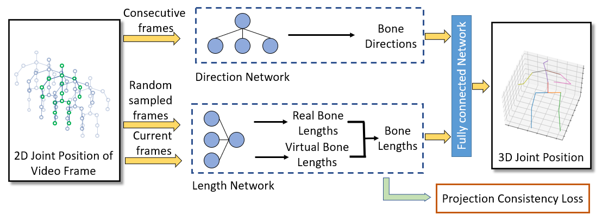

# Motion Projection Consistency Based 3D Human Pose Estimation with Virtual Bones from Monocular Videos



PyTorch code of the paper "Motion Projection Consistency Based 3D Human Pose Estimation with Virtual Bones from Monocular Videos". It is built on top of [Anatomy3D](https://github.com/sunnychencool/Anatomy3D).

G. Wang, H. Zeng, Z. Wang, Z. Liu and H. Wang, "Motion Projection Consistency Based 3D Human Pose Estimation with Virtual Bones from Monocular Videos," in IEEE Transactions on Cognitive and Developmental Systems, 2022, doi: 10.1109/TCDS.2022.3185146.[pdf](https://ieeexplore.ieee.org/document/9802736)

### Environment

The code is developed and tested on the GTX1080Ti with following environment

* Python 3.6.10
* PyTorch 1.0.1
* CUDA 10.0

### Dataset and Visibility Score

The experiments in our paper is trained/evaluated on the [Human3.6M](http://vision.imar.ro/human3.6m) dataset. The dataset used in our code is introduced by [Martinez et al.](https://github.com/una-dinosauria/3d-pose-baseline) and [Pavllo et al.](https://github.com/facebookresearch/VideoPose3D). Please refer to [VideoPose3D](https://github.com/facebookresearch/VideoPose3D) to set up the dataset. The CPN and the ground-truth 2D keypoint data and the corresponding 3D ground truth and visibility score are required and need to be placed in (`./data` directory).

The 2D keypoint visibility scores of the Human3.6M dataset is predicted by [AlphaPose](https://github.com/MVIG-SJTU/AlphaPose).

### Virtual Bone Combination

The virtual bone are proposed in our paper. The selection of virtual bones are various. In our paper, we choose four combinations to experiment in ablation experiment. The final model uses the 23 virtual bones.

If you want to experiment another virtual bone combinations, you need to modify the boneindex in `run.py` and corresponding channel number in `model.py`.

### Training  new models

To train a model from scratch, run:


```bash
python run.py -e xxx -k xxx -arc xxx --randnum xxx
```

As [Anatomy3D](https://github.com/sunnychencool/Anatomy3D), `-e` controls the training epochs (default 60 in our paper), `-k` controls the type of input data, `-arc` controls the backbone architecture of our bone direction prediction network, `--randnum` indicates the randomly sampled input frame number of the bone length prediction network. 

In our paper, we train a 9-frame model and a 243-frame model. For example, if you want to train a 9-frame model with CPN input, please run:

```bash
python run.py -e 60 -k cpn_ft_h36m_dbb -arc 3,3 --randnum 50
```

`-arc 3,3` represents the 9-frame model which in our experiment always train on 1 GeForce GTX 1080 Ti GPUs.
`-arc 3,3,3,3,3` represents the 243-frame model which in our experiment always train on 3 GeForce GTX 1080 Ti GPUs.

If you have a pretrained model to evaluate, put it into the `./checkpoint` directory and run:

```bash
python run.py -e 60 -k cpn_ft_h36m_dbb -arc 3,3 --evaluate xxx
```

The `bin` format file should follow the `--evaluate`.

There are also other arguments in `./common/arguments.py`, such as `-projl1` and `-projd1` which control the weight of projection consistency loss in the total loss.

### Reference

If you found this code useful, please cite the following paper:

```
@ARTICLE{9802736,
  author={Wang, Guangming and Zeng, Honghao and Wang, Ziliang and Liu, Zhe and Wang, Hesheng},
  journal={IEEE Transactions on Cognitive and Developmental Systems}, 
  title={Motion Projection Consistency Based 3D Human Pose Estimation with Virtual Bones from Monocular Videos}, 
  year={2022},
  volume={},
  number={},
  pages={1-1},
  doi={10.1109/TCDS.2022.3185146}}
```

## Acknowledgement

Part of our code is borrowed from [Anatomy3D](https://github.com/sunnychencool/Anatomy3D). We thank to the authors for releasing codes.